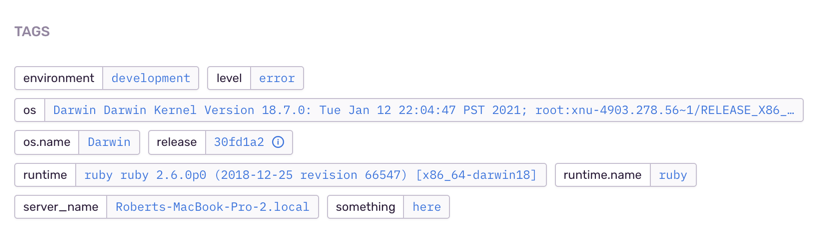

# README

##Getting started
```
bundle install 
rake db:migrate
rake db:seed # for activeadmin
```

## Rails Admin

We use [Rails Admin](https://activeadmin.info/documentation.html) for the backend. 

You can log in by going to http://localhost:3000/admin
```
## Creating admin account in production 
heroku run bundle exec rails c
Admin.create!(:email => 'admin@example.com', :password => 'password', :password_confirmation => 'password')
```

# Omniauth 

We allow users to sign in using omniauth. List of [strategies](https://github.com/omniauth/omniauth/wiki/List-of-Strategies) for what omniauths are available. 

We currently use [GoogleOAuth2](https://github.com/zquestz/omniauth-google-oauth2) 
and I set this up following [this guide](https://medium.com/@adamlangsner/google-oauth-rails-5-using-devise-and-omniauth-1b7fa5f72c8e).

# Delivering emails 

To enable emails to be sent in development env go to `config/environments/development.rb` 
and change `config.action_mailer.perform_deliveries` to `true`

By default production uses GoDaddy (set up follow [these instructions](https://medium.com/@rachelchervin/sending-emails-with-godaddy-and-ruby-on-rails-fc503a45af10)) and 
development uses gmail. 

# Error handling

To get Sentry to fire events in development environment you need to go into `application.yml` and comment out `SENTRY_DSN`.

To start Sentry firing events, either you do the opposite of above or just pass that env variable when starting the app (`SENTRY_DSN='sentry_dsn_goes_here'`)

FYI the 'additional info' that we send with error messages will be saved as tags in sentry (see below): 



For Rollbar you can go into the rollbar initializer and there's a section to comment out, there's a note next to it. 
